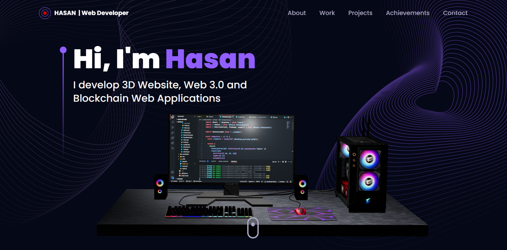
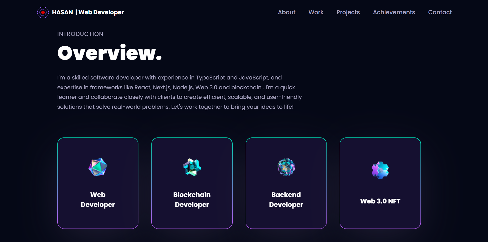
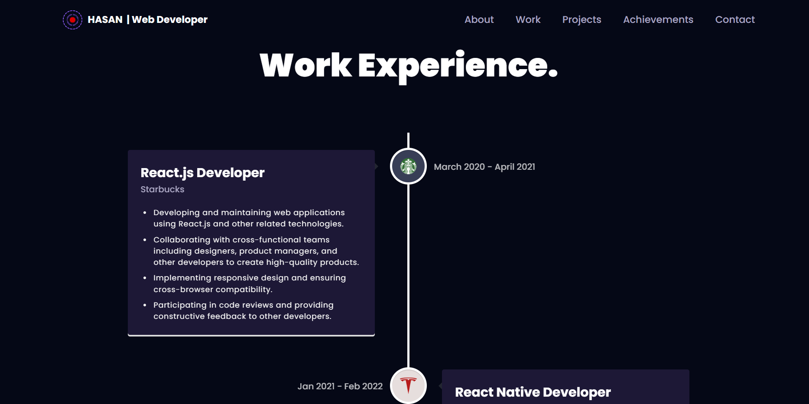
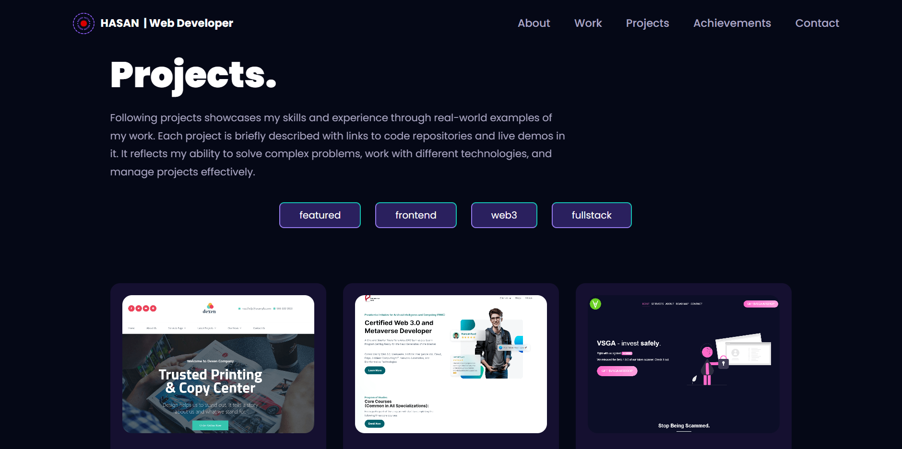
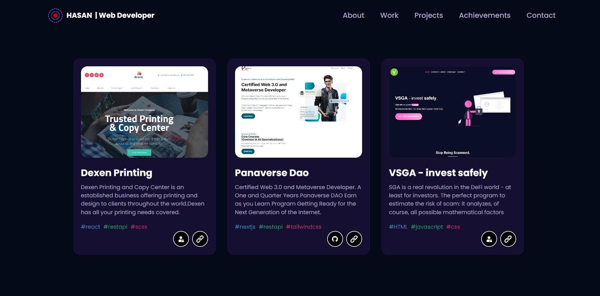
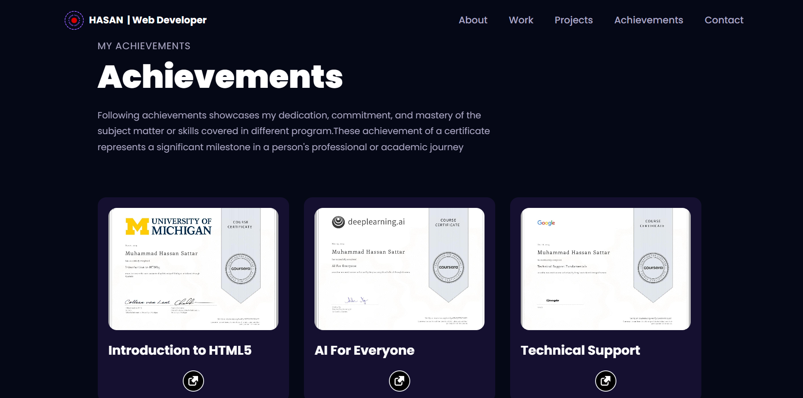
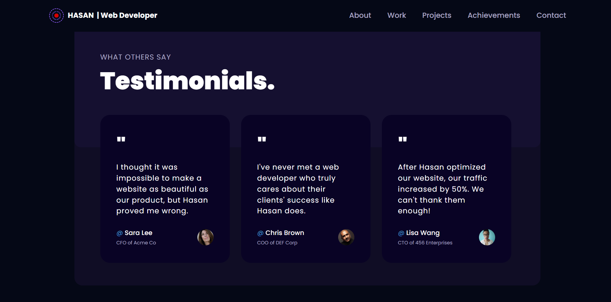
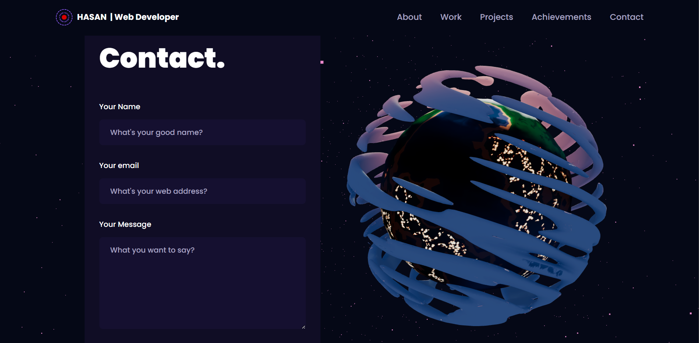
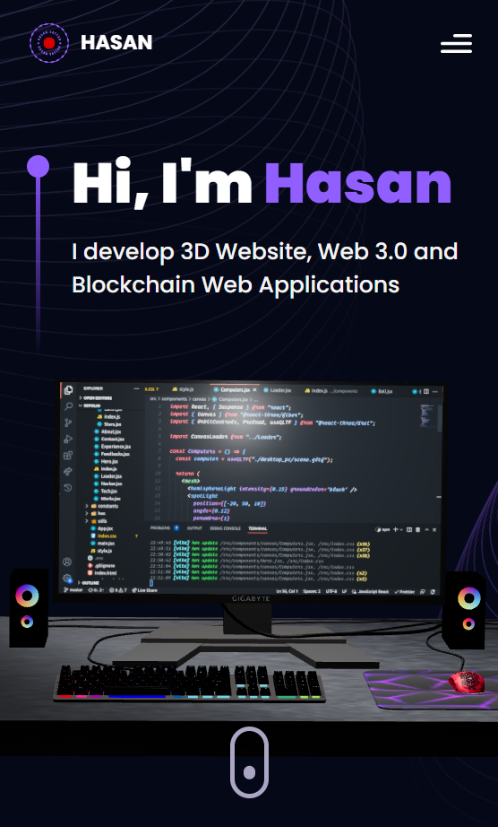

### _3D Portfolio website built using Nextjs,Sanity CMS,Animation, framer motion, tailwindcss. hope you like it.

### website link :link: https://hasansattar-portfolio1.netlify.app/

## Images










## Mobile Responsive




## This step will help you create a Sanity project.

### Step 1: Create a new Next.js project
```terminal 
npx create-next-app
```
### Step 2: Install additional dependecies
```terminal 
npm install --legacy-peer-deps three framer-motion maath @react-three/fiber @react-three/drei @emailjs/browser react-tilt react-vertical-timeline-component
```

### Step 3: Install Sanity Studio
You start by setting up your content editing environment. It’s called Sanity Studio, and you can configure and customize it with JavaScript. It runs in the browser. To develop locally, we need to run a development server so you can see your changes instantly.


#### To get started, run this in your command line:
```terminal 
npm create sanity@latest -- --template clean --create-project "Sanity Project" --dataset production

This will take you through a setup process by guiding you through the following steps:

1. Create an account. Select a login provider from the list of options, and confirm with Enter. After creating an account in the browser, come back to the command line window.
2. It will ask you the following questions.
   - Would you like to add configuration files for a Sanity project in this Next.js folder? Yes
   - Would you like an embedded Sanity Studio? Yes
   - Would you like to use the Next.js app directory for routes? Yes
   - What route do you want to use for the Studio? /studio
   - Select project template to use Clean project with no predefined schemas
   - Would you like to add the project ID and dataset to your .env file? Yes
3. Wait a bit for the installation process to complete. When you get a Success! message, you're good to move on to the next step!! 🎉

### Step 3: Run the Studio locally

```terminal
npm run dev
```


This will start the next js project. Once the build is complete, you can head over to `http://localhost:3000/studio`. It will ask you to add the URL as a CORS origin. Click on Continue to open the Sanity management dashboard. From there, you need to add the CORS origin

This is a [Next.js](https://nextjs.org/) project bootstrapped with [`create-next-app`](https://github.com/vercel/next.js/tree/canary/packages/create-next-app).

## Getting Started

First, run the development server:

```bash
npm run dev
# or
yarn dev
# or
pnpm dev
```

Open [http://localhost:3000](http://localhost:3000) with your browser to see the result.

You can start editing the page by modifying `app/page.js`. The page auto-updates as you edit the file.

This project uses [`next/font`](https://nextjs.org/docs/basic-features/font-optimization) to automatically optimize and load Inter, a custom Google Font.

## Learn More

To learn more about Next.js, take a look at the following resources:

- [Next.js Documentation](https://nextjs.org/docs) - learn about Next.js features and API.
- [Learn Next.js](https://nextjs.org/learn) - an interactive Next.js tutorial.

You can check out [the Next.js GitHub repository](https://github.com/vercel/next.js/) - your feedback and contributions are welcome!


